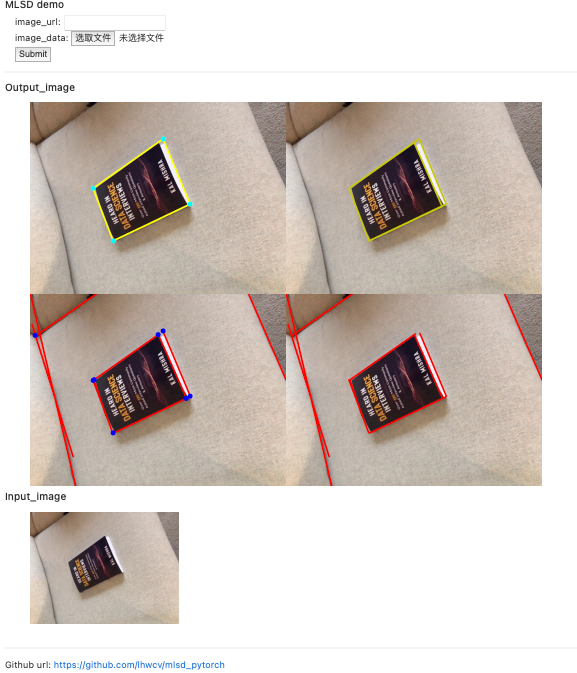

# M-LSD: Towards Light-weight and Real-time Line Segment Detection

Pytorch implementation of *"M-LSD: Towards Light-weight and Real-time Line Segment Detection"* <br/>

origin repo:  https://github.com/navervision/mlsd

- [Paper](https://arxiv.org/abs/2106.00186) 
- [PPT](https://www.slideshare.net/ByungSooKo1/towards-lightweight-and-realtime-line-segment-detection)


## Overview
<p float="left">
  
  
</p>


**First figure**: Comparison of M-LSD and existing LSD methods on *GPU*.
**Second figure**: Inference speed and memory usage on *mobile devices*.

## demo



## How to run demo
### Install requirements
```
pip install -r requirements.txt
```

### Run demo

The following demo test line detect (simplest):

```
python demo.py
```

The following demo run with flask in your local: <br/>

```
python demo_MLSD_flask.py
```
you can upload a image the click submit, see what happen.<br/>
http://0.0.0.0:5000/


## Citation
If you find *M-LSD* useful in your project, please consider to cite the following paper.

```
@misc{gu2021realtime,
    title={Towards Real-time and Light-weight Line Segment Detection},
    author={Geonmo Gu and Byungsoo Ko and SeoungHyun Go and Sung-Hyun Lee and Jingeun Lee and Minchul Shin},
    year={2021},
    eprint={2106.00186},
    archivePrefix={arXiv},
    primaryClass={cs.CV}
}
```

## License
```
Copyright 2021-present NAVER Corp.

Licensed under the Apache License, Version 2.0 (the "License");
you may not use this file except in compliance with the License.
You may obtain a copy of the License at

    http://www.apache.org/licenses/LICENSE-2.0

Unless required by applicable law or agreed to in writing, software
distributed under the License is distributed on an "AS IS" BASIS,
WITHOUT WARRANTIES OR CONDITIONS OF ANY KIND, either express or implied.
See the License for the specific language governing permissions and
limitations under the License.
```
